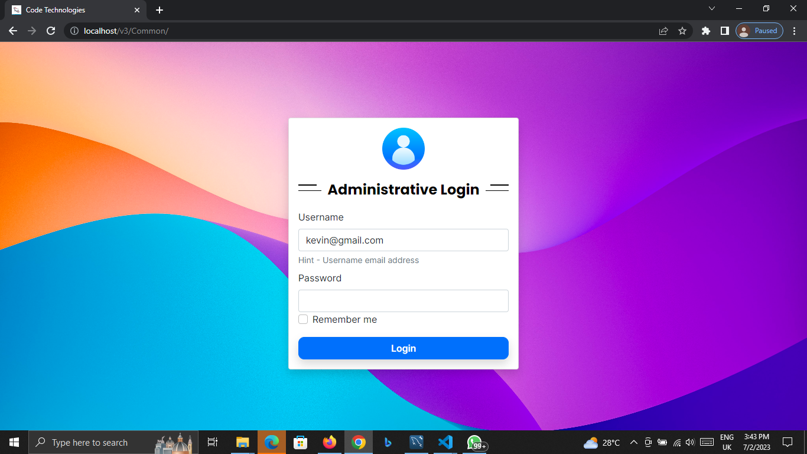

# code_technology_project
<h1>BIT (Bachelor Of Information Technology) </h1>
 
<h2> Final Year Individual Project (Year 3) </h2>

Computer Shop Management System
Author Kevin Shehan Perera
USed Technology 
    -> Pure PHP as Back End
    -> Front End HTML, CSS, Bootstrap 5.0

Used Other Libraries
    -> JQUERY, AJAX
    -> SweetAlert js

Database
    -> MySQL Database

Instruction to use
(before run this project)
    1. Create Database named as V3
    2. import the Database file and execute
    3. after execute this open Web browser (Firefox,Chrome) -> Type
        localhost/v3/common
    4. Username :- admin@gmail.com
       Password :- admin@gmail.com

Used Tool  
Database Manage - Mysql Workbench  
IDE - Visual Studio Code 

